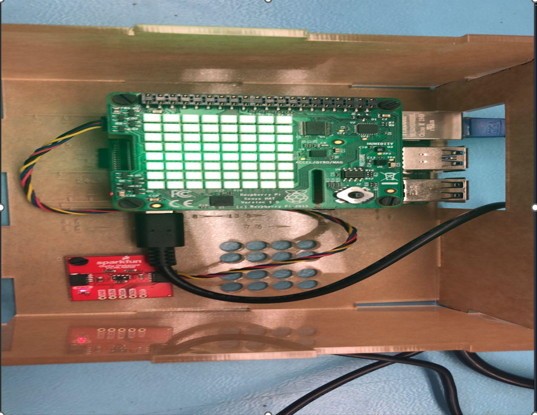
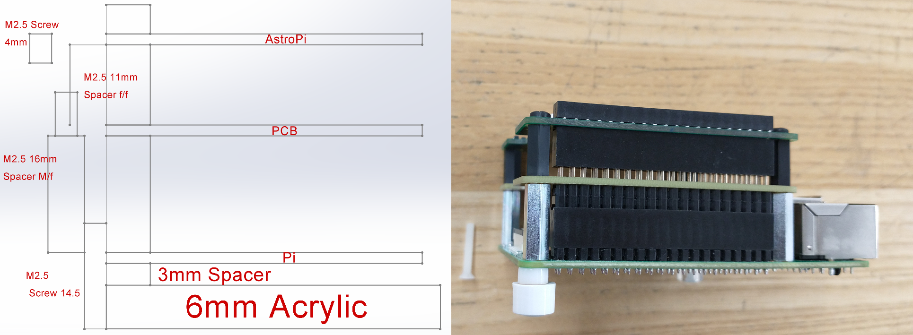
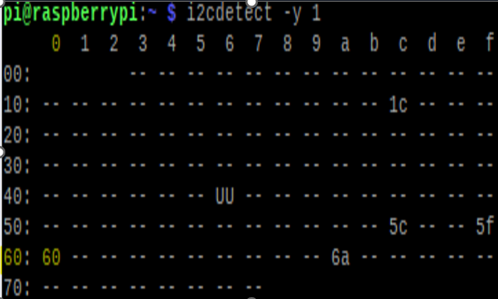
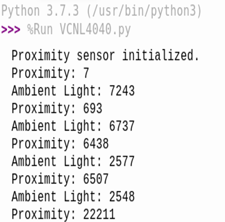

# VCNL4040 Hardware Report

This project demonstrates the creation of a proximity detection system utilizing the Broadcom development platform, primarily involving a Raspberry Pi and the VCNL4040 proximity sensor. Our objective was to engineer a system adept at accurately sensing proximity and ambient light, suitable for applications in automation and interactive installations.

## Project Overview
- **Sensor Integration**: The project included integrating the VCNL4040 sensor with a bespoke PCB, designed in KiCad and connected via an I2C bus.
- **Custom Firmware Development**: We developed custom firmware in Python, enabling the processing and visual representation of sensor data through the Raspberry Pi Sense HAT's LED matrix.
- **Case Design and Fabrication**: A tailored case was also designed and produced to house the components securely.

## Target Audience
- This report is intended for students and enthusiasts in the field of Computer Engineering Technology.

## Report Content
- It comprehensively documents the entire development process, encompassing hardware selection, PCB design, software development, and system assembly.
- The report aims to provide a thorough guide for those looking to replicate or draw inspiration from this project.

## Table of Contents
[1.0 Introduction](#10-introduce-the-broadcom-development-platform-and-exisiting-functionality)   
[2.0 Body](#20-added-functionality)   
[2.1 Sensor/Effector purchase](#21-sensor-effector-purchase)   
[2.2 PCB design and soldering](#22-pcb-design-and-soldering)   
[2.3 Case design and assembly](#23-case-design-and-assembly)   
[2.4 Firmware development and use](#24-firmware-development-and-use)   
[3.0 Testing and Results](#30-testing-and-results)   
[4.0 References](#40-references)  

---

## 1.0 Introduction to the Broadcom Development Platform and Existing Functionality

### 1.1 Overview of Broadcom Development Platform
The Broadcom development platform, prominently represented by the Raspberry Pi, provides a versatile and powerful environment suitable for various projects. Its core features are:

#### Core Components:
- **Processor**: Utilizes ARM-based CPUs, balancing performance with power efficiency.
- **Communication Modules**: Includes integrated WiFi and Bluetooth for wireless connectivity.
- **Interfaces**: Offers a range of I/O options like GPIO pins, USB ports, and HDMI outputs.

### 1.2 Existing Functionality and Applications
The Broadcom platform is celebrated for its adaptability and extensive support for numerous programming languages, including Python, C++, and Java.

#### Current Capabilities:
- Extensive library support for a variety of applications.
- Compatibility with diverse sensors and modules via GPIO and I2C interfaces.
- Supports Linux-based operating systems, providing a robust toolkit.

#### Typical Use-Cases:
- Ideal for IoT projects, home automation, and educational purposes.
- Frequently used in robotics to control sensors and actuators.
- Suitable for crafting bespoke embedded systems for specialized applications.

### 1.3 Development Environment and Tools
The Broadcom platform's development environment is multifaceted, offering a range of tools and IDEs to cater to different programming needs.

#### Software Tools:
- **Raspbian OS**: A Debian-based OS optimized for the Raspberry Pi.
- **VNC Viewer**: Facilitates remote desktop access to the Raspberry Pi.
- **Integrated Development Environments (IDEs)**: Supports IDEs like Thonny, Eclipse, and more.

#### Hardware Tools:
- **Sense HAT for Raspberry Pi**: An add-on board with an LED matrix, joystick, and various sensors.
- **Laser Cutter**: For precision cutting of materials, provided by the school.
- **PCB Maker**: Used for creating custom PCBs, available through school resources.
- **Soldering Iron and Solder**: Essential for securing electrical connections in electronics projects.
- **Multimeter**: Measures voltage, current, and resistance; key for troubleshooting.
- **DC Power Supply**: Provides stable, adjustable DC power during development and debugging.

## 2.0 Added functionality   
### 2.1 Sensor/Effector Purchase

In this stage of the project, key components were acquired to ensure timely progress and quality results.
### Bill of Materials (BOM):
- For a comprehensive list of all parts used in this project, refer to the BOM available at the [GitHub repository](https://github.com/PrototypeZone/hardware-project-DylanAshton2206/blob/main/hardware/bom.md).

  #### Acquisitions:
- **VCNL4040 Proximity Sensor**: Purchased from [SparkFun](https://www.sparkfun.com/products/15177). Opted for express shipping, which remarkably ensured next-day international delivery.

- **Additional Hardware Components**:
  - Standoffs, screws, and Qwiic connectors were ordered from Digikey. These items also arrived promptly with normal shipping.

#### Budget Considerations:
- The subtotal for these components was approximately $278, with the total exceeding $300 after including shipping costs.

#### Shipping Recommendation:
- I highly recommend opting for 1-day shipping. Based on experiences within our project and from others, expedited shipping has proven to be more reliable compared to standard options.

### 2.2 PCB Design and Soldering

In this project phase, a custom PCB was designed using KiCad, with a focus on integrating the VCNL4040 proximity sensor and implementing an I2C bus for effective sensor communication. The PCB layout was planned to include a connection to GPIO pin 17 on the Raspberry Pi for LED functionality. This was crucial for testing the LED using the `gpio_led.py` script, which also served as a quality check for soldering.

#### PCB Fabrication and Soldering:
- After designing, the PCB was fabricated and components were precisely soldered onto the board.
- Special attention was given to the I2C connections to ensure robust communication.
- Post-soldering, the board was rigorously inspected and functionally tested, including verifying I2C bus functionality and LED operation connected to GPIO pin 17.

#### PCB Placement:
- This PCB is placed between the Sense HAT and the Raspberry Pi.
  
  

#### PCB Design Files:
- The entire PCB design and associated files are available at [this GitHub repository](https://github.com/PrototypeZone/hardware-project-DylanAshton2206/blob/main/hardware/pcb) zipped.
- The repository provides detailed insights into the PCB layout and design specifics.
- Important: Ensure strong electrical and mechanical connections when soldering.
- For troubleshooting, check the [README](https://github.com/PrototypeZone/hardware-project-DylanAshton2206/blob/main/hardware/pcb/README.md) on GitHub.

### 2.3 Case Design and Assembly

For the project, a custom case was designed to encase the Raspberry Pi, the VCNL4040 proximity sensor, and the custom PCB. The focus was on functionality and practicality.

#### Case Design:
- Engineered with precision cutouts for mounting the PCB and ensuring secure placement of the Raspberry Pi and sensor.
- Special attention to board mounting holes for a snug fit.

#### Final Assembly:
- Post-design and fabrication, the electronic components were carefully assembled and mounted within the case.

#### Laser-Cut Files:
- The laser-cut files for the case are available [here](https://github.com/PrototypeZone/hardware-project-DylanAshton2206/blob/main/hardware/lasercutting/DylanAshtonLC.pdf).

This case provided a compact, functional, and secure housing for the hardware, contributing significantly to the project's success.

---

### 2.4 Establishing Connection to the Raspberry Pi and Verifying I2C Connectivity

To initiate the connection with the Raspberry Pi and verify the I2C connection, follow these steps:

#### Connecting the VNCL4040 Sensor:
- Attach the VNCL4040 sensor to your custom-made PCB using the Qwiic connector. This step integrates the sensor with your Raspberry Pi setup.

#### Powering the Raspberry Pi:
- Use a USB-C cable to power the Raspberry Pi. Additionally, connect the Raspberry Pi to your PC using an Ethernet cable. This establishes a network connection between the two devices.

#### Remote Access via VNC Viewer:
- On your PC, open the VNC Viewer application.
- Connect to the Raspberry Pi using the IP address `169.254.0.2`. You will need to enter the username and password specific to your Raspberry Pi to gain access.

#### Verifying the I2C Connection:
- Once connected, open the Raspberry Pi's console.
- Type the command `i2cdetect -y 1` and execute it. This command scans the I2C bus for devices.
- If you see the address `0x60` in the output, it indicates a successful connection to the VNCL4040 sensor. This is a positive sign that your project setup is correctly configured and nearly operational.

---

### 2.5 Firmware Development and Implementation

To facilitate the firmware development for this project, we utilized Python, leveraging specific libraries for interfacing with the hardware components:

- **Installing Necessary Libraries**:
  - Visit the GitHub repository at [SparkFun Qwiic Proximity Python Library](https://github.com/sparkfun/Qwiic_Proximity_Py) to access the Python library for the VCNL4040 sensor. Install all the required dependency drivers using the command: `sudo pip install sparkfun-qwiic-proximity`.
  - For the Sense HAT, install its library using `pip3 install sense-hat`.

- **Python Script Setup**:
  - In your Python script, include the line `import qwiic_proximity` to utilize the Qwiic library functionalities for the VCNL4040 sensor.
  - Access the Sense HAT's library by including `from sense_hat import SenseHat`.

- **Firmware Overview**:
  - The firmware, primarily developed in Python, integrates the `qwiic_proximity` library for the VCNL4040 sensor and the `sense_hat` library for the Raspberry Pi Sense HAT.
  - Complete code and detailed installation instructions are available on GitHub at [VCNL4040.py](https://github.com/PrototypeZone/hardware-project-DylanAshton2206/tree/main/firmware).
  - This script includes initializations for the sensor, methods to read proximity and ambient light data, and functions to visually represent this data on the Sense HAT's LED matrix.

### 3.0 Testing and Observations

- **Running the Firmware**:
  - After installing the required libraries, execute the `VCNL4040.py` script. This will initialize the proximity sensor and start data acquisition.
  - The sensor's proximity readings range from 0 to 25,000, with higher values indicating closer objects.
  - The ambient light sensor adapts to varying light levels, providing real-time environmental data.
 
   

- **Troubleshooting Tips**:
  - If you encounter any installation issues, try using `pip3` for library installations. This ensures compatibility with Python 3.
  - To confirm the sensor's I2C connection, use the command `i2cdetect -y 1`. A successful detection will show the sensor's address as `0x60`, indicating proper connectivity and functionality.

## 4.0 References
https://github.com/PrototypeZone/hardware-project-DylanAshton2206
-
https://github.com/sparkfun/Qwiic_Proximity_Py
-
https://www.sparkfun.com/products/15177
-
https://github.com/PrototypeZone/ceng317/blob/main/README.md

